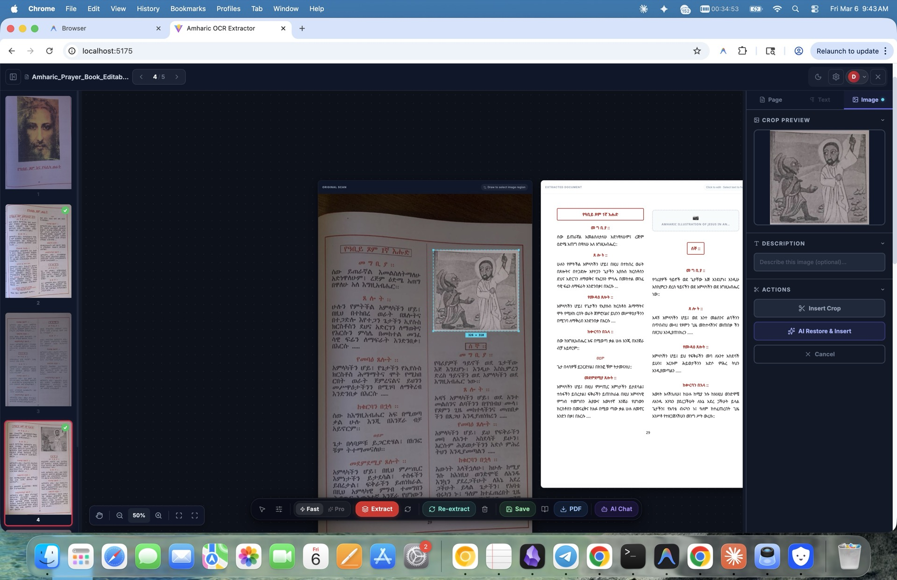

# Amharic OCR Extractor

> Upload scanned Amharic pages. Get accurate, editable text with original layout. Export as PDF, DOCX, or TXT.



## Why this exists

Ethiopic script OCR is an unsolved problem for most tools. Google Docs misses fidel distinctions (ሀ vs ሐ), Adobe Acrobat has no Amharic support, and Tesseract requires local setup with poor accuracy. This app is a purpose-built, one-click solution for Ethiopian publishers, scholars, and church archivists who need to digitize Amharic documents without retyping them.

## What it does

- **OCR pipeline** — Two-pass extraction (raw text recognition, then HTML layout reconstruction) using Gemini 3.1 Flash with Amharic-specific prompts. Preserves fidel distinctions, two-column layout, and embedded images.
- **A4 document editor** — contentEditable canvas with Noto Serif Ethiopic, page-by-page navigation, find-and-replace, homophone correction (common fidel confusion pairs).
- **AI chat assistant** — Canvas-aware agent that can answer questions about the current page or apply edits (change font size, recolor, restructure). No mode toggle — routes chat vs. tool use automatically.
- **Cover generator** — AI-generated cover pages with template grid, photo upload, custom prompt, and binding-type selection.
- **Document library** — Projects saved to Neon PostgreSQL with page images on Vercel Blob. Search, filter, re-open, or download any saved document.
- **Admin panel** — User management, document browsing across all users, block/unblock. Only visible to specified admin emails.
- **Export** — PDF (jsPDF + html2canvas), DOCX (typed with Noto Serif Ethiopic font), plain text, and structured JSON for downstream pipelines (RAG/embedding).

## Tech stack

| Layer | Choice | Why |
|---|---|---|
| Framework | React 19 + TypeScript + Vite 7 | Fastest dev iteration speed for a single-page app; Vite 7's native Tailwind v4 plugin eliminates build config |
| Styling | Tailwind CSS v4 + CSS custom properties | Dark/light mode via a single `data-theme` attribute; no runtime CSS-in-JS overhead |
| OCR | Gemini 3.1 Flash Image Preview | Best accuracy-to-latency ratio for Ethiopic script; two-pass pipeline (raw text → styled HTML) beats single-shot approaches |
| AI Chat | Gemini 3 Flash Preview | Function calling model for canvas manipulation (edit, select, style) |
| Image Gen | Gemini 3 Pro Image Preview | Cover page and illustration generation with Amharic-compatible text |
| Database | Neon PostgreSQL (serverless) | Auto-scaling to zero; Neon Auth provides built-in email auth with JWTs |
| File Storage | Vercel Blob | Direct upload from serverless functions; public URLs for page images |
| Auth | Neon Auth | Email-based sign in/up with zero-config DB-backed sessions |
| PDF Export | jsPDF + html2canvas | Entirely client-side; no server PDF rendering cost |
| Icons | Lucide React | Consistent, tree-shakable icon set |

## Repo layout

```
api/                  # 13 Vercel serverless routes (OCR, auth, DB, Blob, admin)
docs/
  screenshots/        # Drop hero images here (see below)
  OUTREACH.md         # User outreach templates (Amharic + English)
  sample-output-*.pdf # Example OCR output
mcp-server/           # MCP server for Claude Code CLI → canvas bridge
src/
  App.tsx             # Root: auth, process pipeline, screen routing
  components/         # AuthScreen, HomeScreen, AdminPanel, FloatingChat, editor/
  services/           # geminiService.ts (OCR+chat), storageService.ts (DB+Blob)
  lib/                # neon.ts (SQL client), neonAuth.ts, apiClient.ts
  hooks/              # useTheme
  types/              # A2UI, canvas types
  styles/             # Split CSS modules (tokens, base, features)
tests/                # OCR accuracy suite (Python + Node), Vitest unit tests
video/                # Remotion project for promo video
```

## Run it locally

```bash
# Prerequisites: Node.js 18+
git clone https://github.com/Yosef-Ali/amharic-ocr-extractor.git
cd amharic-ocr-extractor
npm install
```

Create a `.env` file:

```env
VITE_GEMINI_API_KEY=your_gemini_api_key
VITE_DATABASE_URL=postgresql://...
VITE_NEON_AUTH_URL=https://...
VITE_ADMIN_EMAIL=your@email.com
```

The app auto-creates the required DB tables on first login. Start the dev server:

```bash
npm run dev
```

Open http://localhost:5173. Upload a PDF or image to begin.

## Deploy

This app deploys to Vercel with a single command:

```bash
vercel deploy
```

Set the same `VITE_*` environment variables in your Vercel project settings. The `/api/blob-upload` serverless function handles image uploads to Vercel Blob automatically.

## Status

OCR accuracy passes at 88% on modern Amharic print (novels, Bibles, prayer books). Fidel distinctions (ሀ/ሐ/ኀ, ሰ/ሠ, ጸ/ፀ) verified working. Two-column layout and embedded image placement preserved. The wedge workflow (upload → accurate text → export) is complete and tested on 10 real documents. Old Ge'ez manuscript OCR is explicitly deferred to a future version.

## Screenshots

Screenshots are in `docs/screenshots/`:

| File | Content |
|---|---|
| `docs/screenshots/home.png` | Home screen — document library |
| `docs/screenshots/editor.png` | Editor — extracted document with floating dock |
| `docs/screenshots/scanning.png` | Scanning / OCR extraction in progress |
| `docs/screenshots/dark-mode.png` | Editor in dark mode |

## License

MIT
